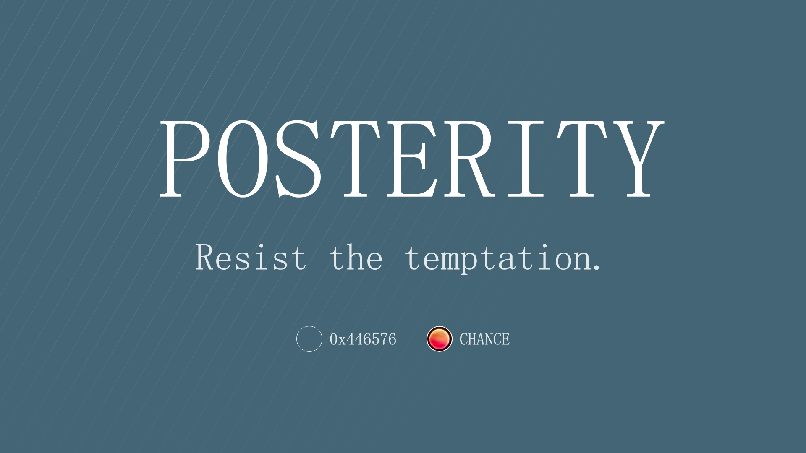

Today, as decentralized workforces continue to grow in popularity, a rising issue is that over time it is natural for a collective and its underlying mission to erode, requiring the maintenance and scaling of existing systems and processes.

Even the most powerful nations and tyrannies have ended in bloodshed at the hand of lost perspective and seclusion from one's local self-identified culture. At a point of ascent, even the most prominent leaders have eclipsed into a gospel of their imaginings that mirages the reality of their people and the collective.

> This article does not explore or attempt to remedy the loss of knowledge due to genocide, exploitation, and other forms of human suffering. However, it does provide a framework to explore how culture can be preserved and propagated in a decentralized network. By utilizing the blockchain, tokens, and social obligation, a collective can ensure that its culture persists and continues to grow even in the face of decentralization and changing times.

The leader of any objective, whether individual or group, always maintains a ethical obligation to ensure the grandiosity of life and that, above all things, the culture of their society persists (good faith). At any measure of scale beyond the direct leaders' impact, the directives must always serve the largest body of good. That is not to be said as the most considerable number of people, but the greatest collective impact can be created and sustained.

Enacted is a model of rudimentary and conceptual formulas to balance the tides of a kingdom's people being able to stay alive and having the luxury to live. For centuries, what can be drowned in depths of nuance has resulted in the toppling of thrones under the iron fist of a less-than-benevolent leader.

Standing in the face of modern politics, even bipartisan government bodies struggle to persist in a society of growing scrutiny and distrust. There is always a straw that breaks a camel's back, but what if there did not have to be?

Historically, the power of a network has been reliant on *leadership* to direct local society and its people to a future that is not self-serving. With near-countless active political models, the issue has proven to be far more complex than first perceived. So much more complex that to attempt a new paradigm, one must first explore the concept of societal, cultural, and knowledge obligation.
  
*Painting a vivid picture, this problem can be easily illustrated with a perspective shift to real-world pyramids.* 

The Egyptians built incredible pyramids and reached architectural feats that would be incredibly difficult, time-consuming, and expensive even today.

The brilliance and knowledge required to accomplish such a feat cannot be downplayed. Nevertheless, one occurrence of such high-caliber achievements could be considered a freak occurrence.

As another example, there have been generations and centuries of knowledge and history lost in places such as Hindu Temples, both spiritual and architectural.

In many cases of significant knowledge loss, it is often an extremely sophisticated society. However, knowledge was lost to time, and the processes to replicate still need to be rediscovered. Notably, the creation (and even writings) of The Great Pyramids and Hindu Temples took place on opposite sides of the world. It was not just one incredibly advanced society that crumbled and lost the methods to its ways, but many through all of the time.

One may argue that an individual's well-being in a society often has little to do with their contributions outside of personal consequences. Complacency seeps through every being of society, slowly destroying the fundamental ideals of the establishment. The incent for all has been low as very few have ever wielded a reach broad enough to touch global audiences until recently, with the explosion of the internet and social media. While The Butterfly Effect could knock twelve elephants over, there is nothing genuinely holding an individual obligated to maintain the persistence of the culture and knowledge primarily because one has very little ability to impact the world directly.

Utilizing the power of a blockchain, a network of individuals can employ a mechanism that creates a system of obligation to ensure that the culture continues to grow and spread through the reaches of time. Critically, sustainability and persistence do not mean zero loss; only that strategic loss enables a healthier system.

One way to accomplish this is through incentivizing people to contribute their knowledge or resources back into society so they can benefit from collective improvements made by others. This concept has been explored before, such as in blockchain-based projects which reward miners for providing computational power; however, these have yet to have broad adoption outside speculators looking to make money off them (which defeats some of its intended purposes).

Let us take it a step further and discuss a real-world implementation for the scenario in which you house a 100-person, highly curated, valuable group of individuals. The network is more significant than its leader, and because of that, the culture must be able to bend around the normalities of the active population at any given generation. As a decentralized force, there cannot, should not, and will not be a forever persistent leader.

Leaderless direction is not an outcome that comes magically, in any case. Contrary to traditional approaches, rather than attempting to incentivize good actions monetarily, this is a paper that explores the concept of creating *ethical obligation* that incentivizes participants. 

As defined by Kant in The Doctrine of Right, *obligation* is the neccessity of a free action under a catergorial imperative of reason. **An imperative is a practical rule by which an action in itself contingent is made neccessary.**  Vitally, the aim is to create a system where decision of participation itself becomes the incentive.

To accomplish this, a collective of individualized may be tokenized and offer 100 $REP to every new society member as a *Birth-Right.*

The $REP is the driving onboarding mechanism of the collective of its culture. With $REP, an individual may invite another and, in turn, inject another 100 $REP into the network.

Maintaining the supply of members and $REP is an active decay rate that results in every individual losing a pre-determined amount of $REP per week for as long as they hold more than 0 $REP. Hereby creating an ethical obligation to help the system grow in order to maintain the same share that is had today. The growth of $REP (the proxy of culture) relies on perpetual collective maintenance, harmony, and, ironically, discourse. However, rather than being an ambiguous activity that cannot be tracked, this mechanism explores a new type of cultural obligation at a public and private level.

> Important to note, there exists no law or mechanism that upholds the sanctity of the society; for that is the duty of the society members. Moral obligation is not defined by an externally defined law, but a creation of ones own moral and ethical compasses and choices. There is no law requiring any individual to participate, beyond ones own personal and self-measured level of duty.

Self-efficacy is a function of efficacy, and a system of direct impact delivers personal empowerment to every individual in the collective. With decay, if all individuals decayed to 0 $REP, a new individual could not be added without removing oneself from the network. Additionally, even those that do not believe themselves to be high-value contributors now have a concrete way to directly contribute to the growth and prosperity of the local society.

In a model like this, decentralization works in harmony with the individual and provides a new type of social obligation that the network can track. *Birth-based scaling* creates an environment where growth is not only incentivized but also expected -- as without it, there is no longer any value to what was once so valuable, the culture.

Analytically, this would mean that growth is a function of reputational decay with:

$$\max{Growth} = \frac{1}{D} \times M_A$$

Where:
				* $D$ as *Decay Rate*
				* $M_A$ as *Members Added*

To extrapolate this into a concrete example, the maximum amount of $REP inside the ecosystem can be calculated with the equation:

$$\$REP(t+1) = REP(t) + (C \times M_I) - (D \times M_A \times E)$$

Where:
				* $C$ as *Generational Capacity*
				* $M_I$ as *Members Invited*
				* $E$ as *Generation Epochs Passed*

Critically with this, there is no need to have an actively validated calculation. Without the need for constant validation, rather than running a network of keepers to process transactions forever, an individual's reputation balance is updated a priori for any use, thus preventing unexpected usage alongside the recording of births and deaths that prevents any out-of-realm activities. A perished individual cannot be revived.

While knowledge is often lost to time, every individual and, in turn, every society loses shards of knowledge during transfer. In a conversation or teaching, the individual sharing the knowledge can only transfer knowledge with certain details being included and understood. Whether a conversation between two or two hundred members, knowledge transfer does not come without *knowledge cost.*

Operating with a high level of scrutiny, we know systems of society do not act perfectly as expected or even *rationally.* While the cost of knowledge transfer between two parties may be linear and strictly relative to their interaction, the resulting behaviors of larger groups are not linear. This means that the cost of knowledge transfer must respond to the recent-activity knowledge share.

Utilizing a [Variable Rate GDA](https://www.paradigm.xyz/2022/08/vrgda), the economic cost of entry can respond to the growth of the ecosystem in order to balance the "downsides of growth." This means that in times of a large number of additions, the cost needs to increase, while in times of low activity, the cost of birth needs to be lower. To manage this, a dynamic formula is applied that responds to the recent activity of the network.

The price of each birth is given by some _price function_, $p(t)$, where $t$ is the time since its start. Just like in discrete GDAs, many different price functions can work. One such function is:

$$
p(t)=k \cdot e^{-\lambda t}
$$
Where:
				* $\lambda$ as *Decay Constant*
				* $k$ as *Starting Price*

Price decays exponentially according to some _decay constant_ $\lambda$, while $k$ controls the starting price.

The total price of purchasing $q$ tokens using the above price function can be calculated efficiently on chain. As shown in the appendix, this price is given by:

$$
P(q)=\frac{k}{\lambda} \cdot \frac{e^{\frac{\lambda q}{r}}-1}{e^{\lambda T}}
$$

In reality, populations of society tend to go exponential given a long enough horizon and supporting resources. While based on reality, faults of real-world systems can be avoided in codified environments. Therefore, to protect against the exponential growth, the cost of birth will grow at a more rapid rate the closer the active population is to the generations capacity. This can be thought of as being bound to the resources one has available on their planet. *The cost of birth is higher when resources are more scarce.*

To ensure that the system works as intended, a few more measures must be taken to support a truly sustainable model.

**(Codify the act of celebration)**: For example, a periodic reward system can be implemented to ensure that the collective's most valuable members are rewarded for their contributions. This reward system can be determined by a predetermined algorithm that evaluates an individual's contributions and rewards them accordingly.

**(Codify the act of tradition)**: Furthermore, it should be possible to track the progress of the collective by providing real-time data and analytics. This could be done by providing a dashboard that tracks the collective's progress and allows members to view their contributions and progress. 

**(Codify birthing of new society members)**: Finally, it is essential to ensure that the amount of $REP needed to join the collective is reasonable. The amount should be set to a level that allows members to join without feeling overly burdened but also ensures that the collective is kept alive and growing. Too high of a price could deter potential members, while too low could cause the system to be exploited. 

Of course, such a system always has small nuances and potential downfalls. To manage, an organization must have a more significant mechanism than just a system that obligates individuals.

1. What if members of the collective need to be more active? 

In order to combat this, members should be required to complete specific tasks or activities to remain active. This could be done by setting a certain amount of required participation or by setting certain milestones that must be met for members to remain active.

2. What if members do not contribute to the collective? 

The reward system should be tailored to ensure members are incentivized to contribute to the collective. The reward system should also be designed to ensure that the most valuable contributions are rewarded the most. Additionally, members should be held accountable for their actions and contributions to the collective. This could be done through a system of warnings or a point-based system that tracks an individual's contributions. 

3. What if members do not trust the system? 

In order to ensure that members trust the system, it should be designed in such a way that all transactions are transparent. Additionally, a system of checks and balances should be in place so that members can trust that their contributions are being properly accounted for. 

It is essential to recognize that there is no one-size-fits-all solution to the issue of culture and knowledge erosion. However, by leveraging the power of decentralization and utilizing a system of social obligation, it is possible to create an incentivized system that promotes the maintenance and growth of a collective's culture. By utilizing such a system, a collective can ensure that its culture persists even in the face of decentralization and changing times.

The resulting societal obligation is one of many benefits being crafted with this model. The Library of Alexandria was renowned in Ancient Egypt and rumored to contain hundreds of thousands of scrolls and books. It was a repository for knowledge and a hub for scholars and thinkers worldwide. 

Unfortunately, it fell into disrepair and was destroyed by fire during the Roman siege of the city in 48 BCE, leading to the loss of centuries of knowledge. 

The blockchain differs from the Library of Alexandria because it provides a secure and immutable data record that can store and protect knowledge over time. Unlike the Library of Alexandria, the blockchain does not need to be housed in a physical building; rather, it can exist on a distributed ledger that is accessible to anyone with an internet connection. Additionally, the blockchain is resistant to tampering and manipulation, allowing it to remain secure even if attacked or corrupted. Finally, the blockchain allows for the creation of tokens and smart contracts, which can incentivize network participants to contribute to the collective. This resistance ensures that the network's culture persists as individuals are rewarded for their contributions.

In summary, blockchain, tokens, decay, and obligation can be used in combination to protect against the loss of knowledge and ensure that the culture of a network persists. Standing a level above The Library of Alexandria, a model built on the blockchain can bring the proverbial lost knowledge back to life. Instead of the incineration of history, a system of social obligation can be used to ensure that the culture of a network persists.

By implementing a reward system, tracking progress, and setting a reasonable joining fee, a collective can ensure that its members are responsible for contributing to the collective's growth and longevity.

> This study and paper was a collaboration between [nftchance](https://twitter.com/nftchance) and [0x446576](https://twitter.com/0x446576). All code is licensed under AGPL-3.0 and can be found on [GitHub](https://github.com/0x446576/posterity). 
> 
> Direct communication and contacts to 0x446576.